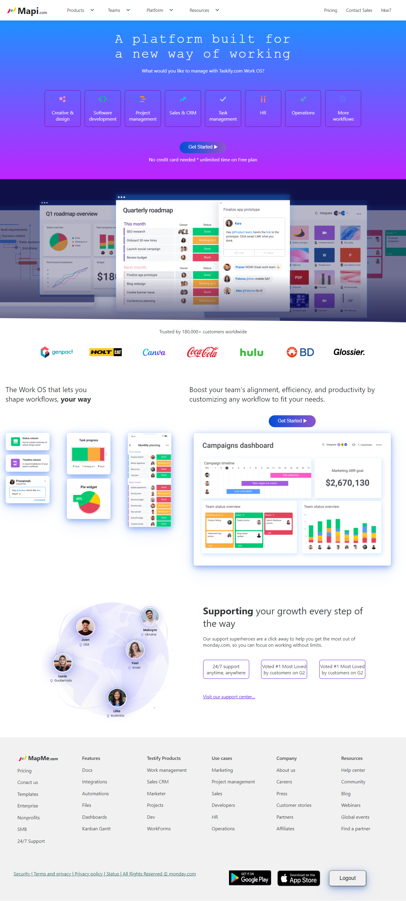
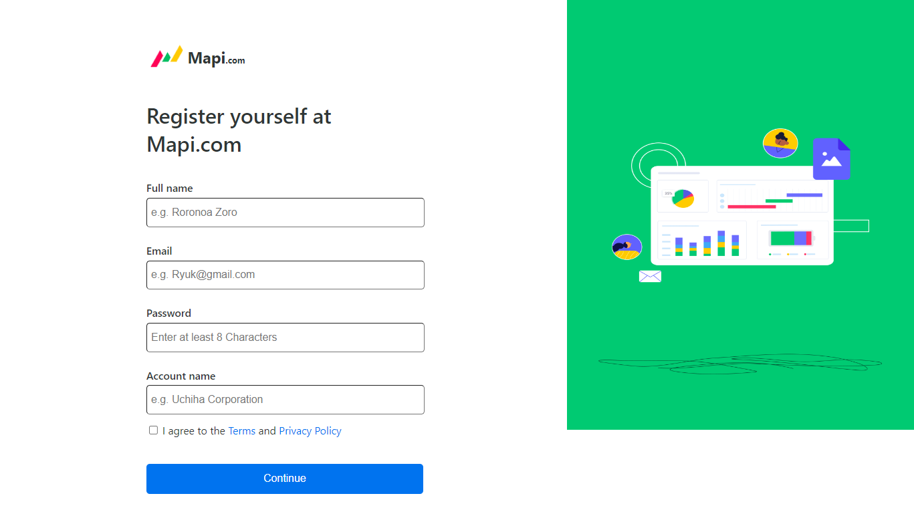
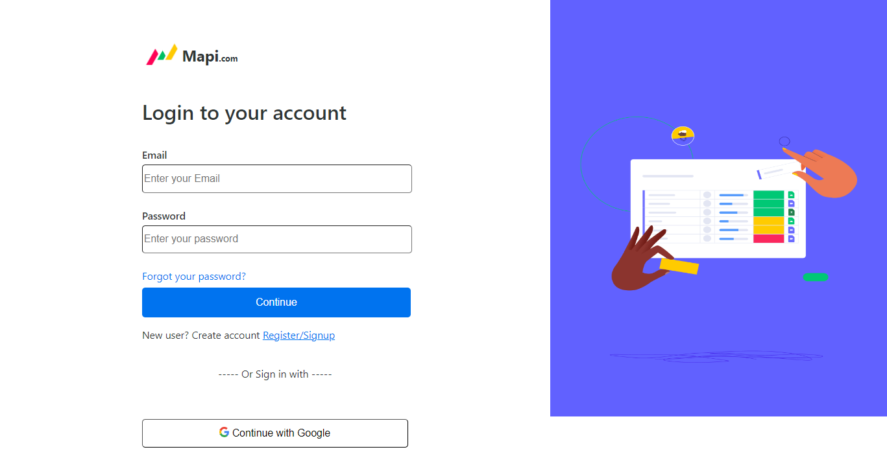
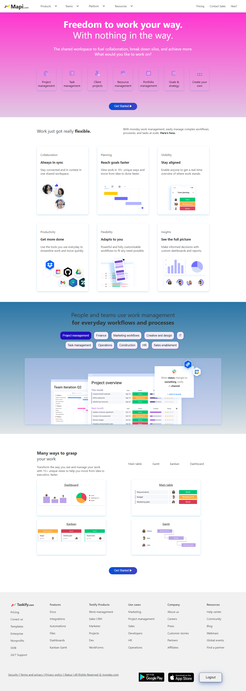
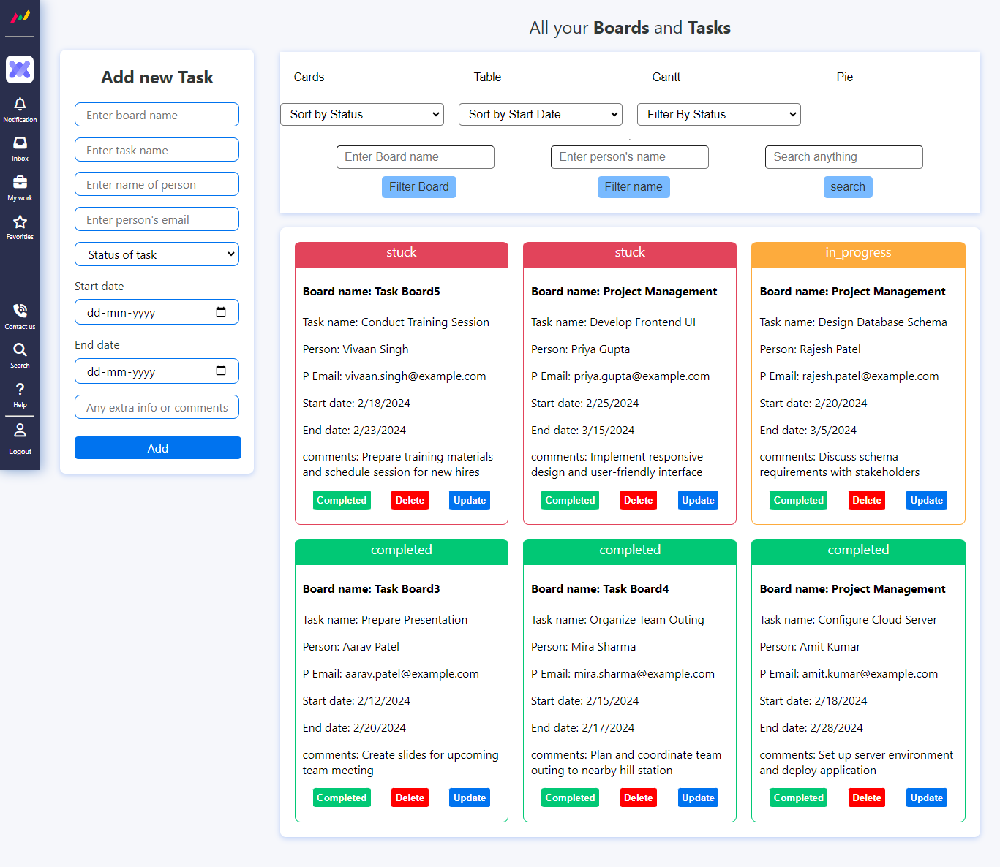
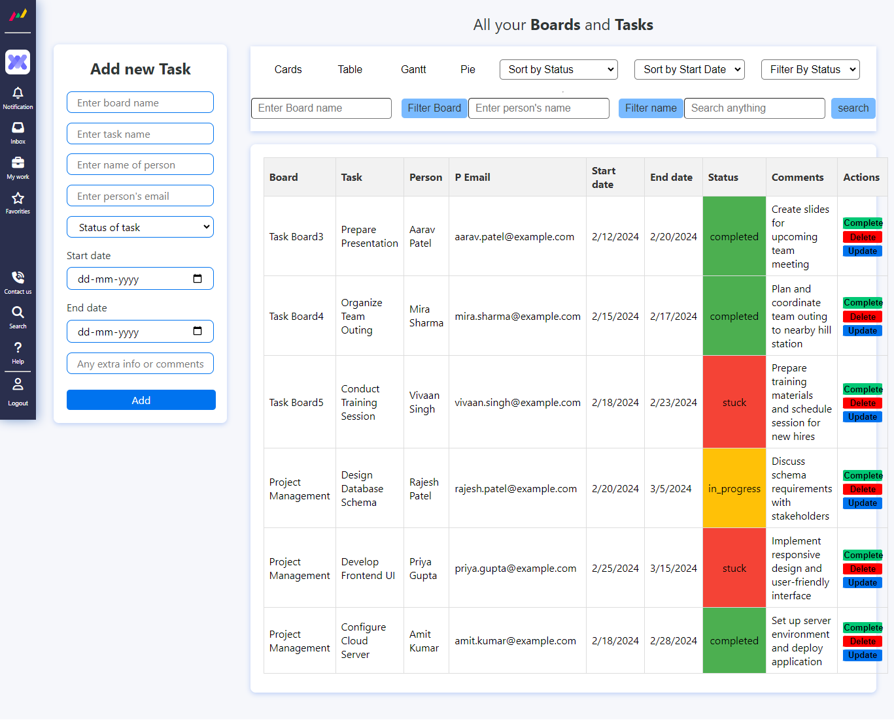
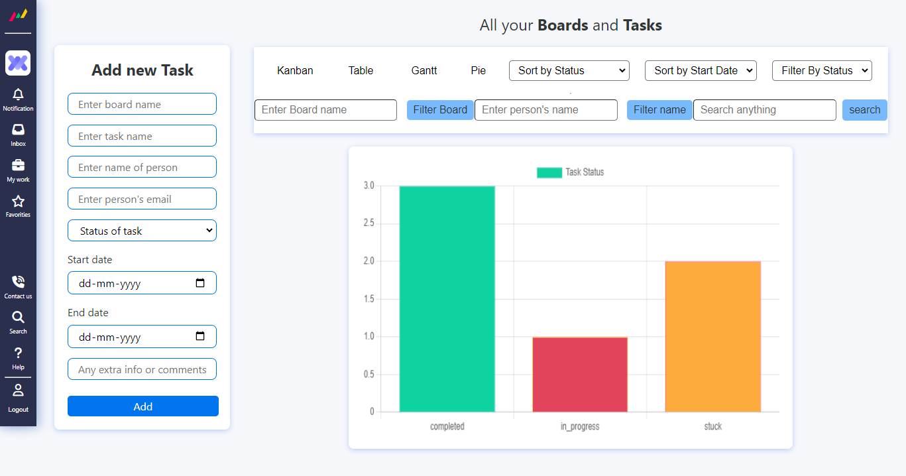
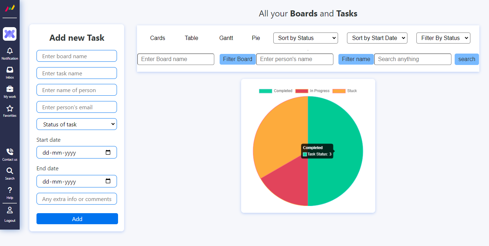

# Welcome! To Mapi.com

Welcome to Mapi.com! This is a Flask-based web application designed to help users manage their tasks effectively.

## Table of Contents

- [Features](#features)
- [Installation](#installation)
- [Usage](#usage)
- [Endpoints](#endpoints)
- [Technologies Used](#technologies-used)
- [Contributing](#contributing)
- [License](#license)
- [Screenshots](#screenshots)

## Features

- User registration and authentication
- Creating, updating, and deleting tasks
- Filtering tasks by various criteria (e.g., status, start date, board name)
- Generating pie charts to visualize task status distribution

## Installation

To run the Task Manager App locally, follow these steps:

1. Clone the repository:

   ```bash
   git clone https://github.com/8309h/mapi.com.git
   ```

2. Install the required dependencies:

   ```bash
   pip install -r requirements.txt
   ```

3. Set up environment variables:

   - Create a `.env` file in the root directory of the project.
   - Add the following variables to the `.env` file:

     ```plaintext
     DATABASE_URL=<your_database_url>
     SECRET_KEY=<your_secret_key>
     ```

   Replace `<your_database_url>` with the URL of your MongoDB database and `<your_secret_key>` with a secure secret key for JWT token generation.

4. Start the Flask server:

   ```bash
   python app.py
   ```

5. Access the Task Manager App at `http://localhost:5000` in your web browser.

## Usage

- Register a new user account or log in with an existing account.
- Create, update, delete, and view tasks.
- Filter tasks by status, start date, board name, and other criteria.
- Generate pie charts to visualize task status distribution.

## Endpoints

The Task Manager App provides the following API endpoints:

- `POST /api/users/register`: Register a new user account.
- `POST /api/users/login`: Log in with an existing user account.
- `POST /api/tasks`: Create a new task.
- `GET /api/tasks`: Retrieve all tasks belonging to the logged-in user.
- `PUT /api/tasks/<task_id>`: Update an existing task.
- `DELETE /api/tasks/<task_id>`: Delete a task.
- `PUT /api/tasks/<task_id>/complete`: Mark a task as completed.
- `GET /api/tasks/sort`: Sort tasks by start date.
- `GET /api/tasks/filter`: Filter tasks by status.
- `GET /api/tasks/filter-by-board`: Filter tasks by board name.
- `GET /api/tasks/filter-by-name`: Filter tasks by person name.
- `GET /api/tasks/search`: Search tasks by task name.
- `GET /api/tasks/pie-chart`: Generate a pie chart to visualize task status distribution.

## Technologies Used

### Backend

- **Python**: Programming language used for backend development.
- **Flask**: Micro web framework used for building the web application.
- **MongoDB**: NoSQL database used for storing task data.
- **Flask-JWT-Extended**: Extension for JWT token-based authentication.
- **Flask-CORS**: Extension for handling Cross-Origin Resource Sharing.
- **Matplotlib**: Library used for generating pie charts.

### Frontend

- *Your frontend technologies here (e.g., HTML, CSS, JavaScript, chart.js,)*

## Contributing

Contributions are welcome! Feel free to open an issue or submit a pull request for any improvements or bug fixes.

## License

This project is licensed under the [MIT License](LICENSE).


## Screenshots

### Mapi.com Dashboard



### Register Page



### Login Page



### Work Management Page



### Card Page



### Table Page



### Ghant Page



### Pie Chart Page



